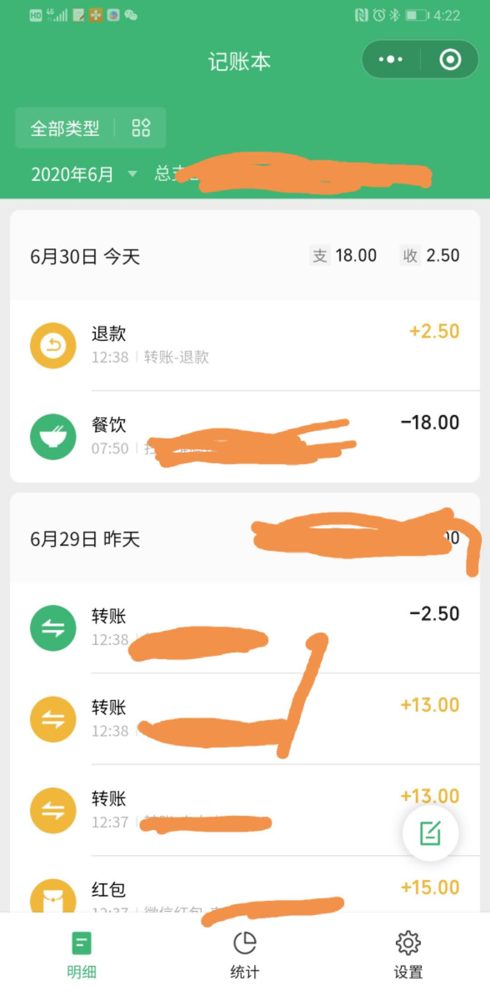

## 背景
为了生活更美好，最近开始学起了理财。
穷人家的孩子，从小到大没人告诉过你理财的重要性，自然也就没那习惯了，后来自己出来赚钱了。自然开心啊，自己的钱次怎么花就怎么花。之前喝瓶可乐都要问老爸老妈，现在直接一箱箱买，想喝就喝，快哉快哉。
长期这么自由自在真的很爽，可存款却永远在原地踏步，不见增长。眼看身边的人都买车买楼了，而自己还一无所有。可见凡事都有代价的。
总结下原因就是不会理财、大花、月光族等等。于是痛下决心开始理财，控制自己的消费。
第一步就当然是记账啦。记账可以知道自己每个月的消费、收入，清晰知道自己主要消费在哪里？哪些消费过度了，应该控制下的。但这一步也是艰难的一步啊！

<!-- more -->
## 市面上的记账软件
说到记账，第一步就是找个好用的记账软件了。
市面上的记账软件很多，基本都满足需求。但！就是坚持不下去，因为每次的消费都要手工在软件上记下去，坚持了10 天坚持不了15天。换了很多了记账软件都这样，功能是满足了，但没解决我的懒惰啊。而已有时很匆忙的一笔微信转账，一下就忘了记账了。
于是乎我在继续寻找适合我的记账。我的设想就是有没有可以读取信息的记账软件，然后我以后的消费都走银行卡，消费了收到信息，软件自动记录，是不是很方便？
但在市面找了一圈后发现，有些记账软件是可以读取短信消费记录的，但它并不知道消费的分类，需要自己的手选是个大工程。然后各种卡的话也容易混淆。原本想自己找时间写一个的，读读短信信息应该没什么难度。但后来我找到了一个比较理想比较适合我的记账软件，也就省得我自己开发了。
## 微信记账本
我的最终选择就是微信记账本。是一个小程序很方便也不用安装。他可以读取你的微信各种消费和各种收入信息，我本来的比较多的也就是微信支付，除了keep会员是华为支付，京东购物用的是京东支付外，都是走的微信支付，自动记录。现在我只要要用其他不走微信支付的支付方式改成微信支付就好了。比如取消keep在华为支付的自动续费，改微信支付自动续费。京东购物也不用京东支付了，直接走微信支付，这样就搞定了，是不是很方便？
而且微信记账本有一个好处就是商家走微信支付时，每一笔的消费都已分好了消费类目，所以可以自动给每笔消费分类，而且你的微信转账，收发红包都会一一帮你记录，实在太适合了。微信的确定就是淘宝购物吧，好像不支持微信支付的，需要手动去添加记录。还有就是银行卡的收入比如工资，也要自己手动去添加记录，还好的是微信记账功能有个提醒功能，比如工资，你可以设置个提醒，每个月发工资时提醒添加工资收入记录。而且在微信的生态里，我们平时用得最多的就是微信了，可不大可能会错过没看到提醒。
如果你觉得也很懒，不妨按照我的方式试下微信记账本吧。
如果你觉得对你有帮助，可以请我喝杯奶茶哦😬

