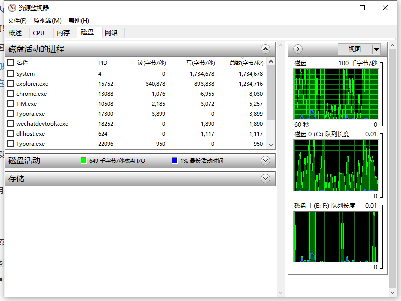

# 起因

> 本文章比较详细地讲述了，怎么找到解决问题的过程。如需要直接看解决方法，请直接跳到文章最后`总结`部分

有些工作比较繁琐，于是想写个程序来自动化处理下。

一直在玩`nodejs`了，那就自然用`electron`,谁知道还有`electron-vue`项目可以使用vue写页面，真香！撸起来。

不得不说，`electron`把桌面端开发门槛降到了最低啊，随便一个前端都可以写桌面端了。打包也简单，直接`run build`自动下载依赖包，帮你构建好了，香香香！

然后我修改了写东西，在构建打包就报错了: `EBUSY: resource busy or locked`

看错信息无非就是目录被占用着，然后我并没有占用啊，文件夹什么都关闭，Idea都关闭了也不行，那只好百度一下了。

百度后又要发牢骚了，国内的技术文章真的是一个copy一个，对于这个问题都是一个答案: 进程里开了好几个exe文件， 把他们关掉就好了。

什么exe程序，一脸懵逼啊！这样写什么博客呢，越看越蒙啊。

<!-- more -->

指出来严重批评下，希望国内的技术文章环境越来越好啊，多些原创。非要copy转载的，你也验证下文章的办法啊，看是不是正确啊

- [electron打包遇到的问题 EBUSY: resource busy or locked](https://blog.csdn.net/WangYiwei_/article/details/107020849)
- [electron packager打包报错： EBUSY: resource busy or locked](https://blog.csdn.net/qq_40015157/article/details/112219996)

# 解决过程

百度解决不了只好翻墙goggle了，但goggle关于这问题很少啊也没人回答只好靠自己的。

思路

1. 问题出现在目录没占用
2. 找到占用目录的进程
3. 关掉它，应该就好了

然后百度了下关于占用资源监控的，`windows`有个资管 `资源监视器`，打开方法

1. `win + R`键，输入`resmon.exe`运行即可
2. 有时记不住英文啊，直接记中文也行啊，`win`菜单旁边直接搜索`资源监视器`就可以找到了

长这样：

打开后我们切换到`cpu` 选项，有个`关联句柄`的一栏，搜索句柄哪里输入要搜索的内容，比如我的项目目录名是``electron-demo`我就输入`electron-demo`,再点搜索。然后搜到到了两个`expolorer.exe`程序占用着，也就是两个`资源管理器`，资源管理器一般就一个的。

我试着把一个`expolorer.exe`进程结束了它，然后发现两个都被结束了。然后菜单栏桌面图标都不见了，这里就要手动添加一个资源管理器了。

`win + R ` 输入 `expolorer.exe`就可以，然后再跑一次程序发现问题解决了。

从这里就发现了其实就是被不知道哪里多出来的一个`expolorer.exe`占用了。但是这样每次关闭新建`expolorer.exe`有点麻烦，简单点看下面总结。

# 总结 

1. 打开`任务管理器`也就是进程管理
2. 找到`expolorer.exe`进程
3. 右键重启，就可以了

